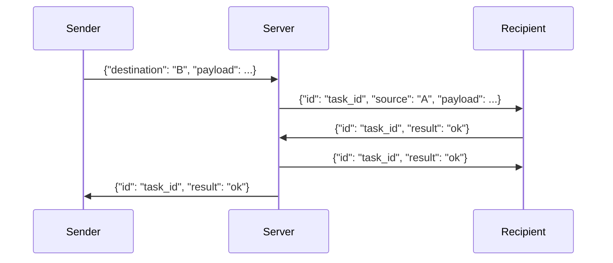

# NoVelocity's Communicator (Server)
## Communicator Server — Protocol (Generated from `.py` by AI)

Description of the WebSocket protocol used by
[NV-Communicator-Server](https://github.com/NoVelocity/NV-Communicator-Server):
a simple relay server that forwards messages between clients by their
`client_id` and waits for a delivery acknowledgement.

## Connecting

Each client keeps a single WebSocket connection, with its own identifier
passed in the path:

```
ws://host:port/{client_id}
```

All further messages are text JSON frames.

## Sending a message to another client

To send `payload` to the client with id `<id>`:

```json
{"destination": "<id>", "payload": <any JSON>}
```

The server generates a `task_id` and forwards the message to the recipient:

```json
{"id": "<task_id>", "source": "<your client_id>", "payload": <payload>}
```

> **Important:** the sender is never told the `task_id` in advance — it only
> appears in the final result frame (see below).

## Recipient's reply

Upon receiving a message, the client must reply, referencing the same
`task_id`:

```json
{"id": "<task_id>", "result": "ok"}
```

Instead of `"ok"`, you can return your own error-code string — it will be
forwarded to the sender (see below).

The server processes the reply in two steps:

1. **Acknowledges receipt to the recipient**:

   ```json
   {"id": "<task_id>", "result": "ok"}
   ```

   or, if the task is already closed (e.g. it already timed out and an
   error was already sent to the sender):

   ```json
   {"id": "<task_id>", "result": "ERR_SRV__NO_DELIVERY_TASK_WITH_CURRENT_ID"}
   ```

2. **Forwards the outcome to the original sender**:

   - if the recipient replied `"ok"` → the sender receives `"ok"`;
   - if the recipient replied with its own error code `<CODE>` → the sender
     receives `"ERR_DESTINATION__<CODE>"`.

   ```json
   {"id": "<task_id>", "result": "ok"}
   ```
   ```json
   {"id": "<task_id>", "result": "ERR_DESTINATION__<CODE>"}
   ```

## Server-side delivery errors

These codes can reach the sender without any involvement from the recipient:

| Code                                                   | When it occurs                                                |
|----------------------------------------------------------|------------------------------------------------------------------|
| `ERR_SRV__NO_ACTIVE_CLIENT_WITH_CURRENT_DESTINATION_ID`   | no client with the given `client_id` is currently connected      |
| `ERR_SRV__DESTINATION_TIMEOUT`                            | the recipient did not reply within the allotted time (15 s by default, configurable on the server) |
| `ERR_SRV__DESTINATION_DISCONNECTED`                       | the recipient disconnected before replying                       |

## Exchange diagram



## Summary of outcomes for the sender

| Result seen by the sender              | Meaning                                         |
|------------------------------------------|---------------------------------------------------|
| `ok`                                      | delivered, recipient confirmed success             |
| `ERR_DESTINATION__<CODE>`                 | recipient explicitly replied with error `<CODE>`   |
| `ERR_SRV__NO_ACTIVE_CLIENT_WITH_CURRENT_DESTINATION_ID` | recipient is offline                |
| `ERR_SRV__DESTINATION_TIMEOUT`            | recipient did not reply in time                    |
| `ERR_SRV__DESTINATION_DISCONNECTED`       | recipient dropped before replying                  |
